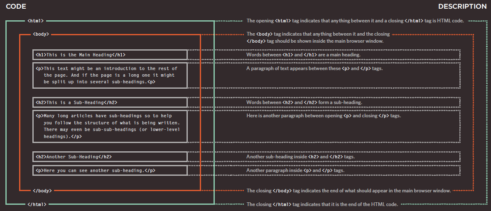

# Frontend webdesign

A website consists of a structure (what is on the page) made in HTML and styling (how and where is something on the page) done in CSS. In this form the web page is static, so there is no change due to interaction or data changes.

## Developmenttools

Because HTML is actually just text, you can use your favorite text editor such as Notepad, Notepad++, Visual Studio Code, Brackets, ... for this. Some of those editors also offer a 'live preview' which is very useful while you are designing your page.

We use Visual Studio Code to build our projects. If it is not already installed on your system, go to the [Visual Studio Code website](https://code.visualstudio.com/) and download the version for your system. 

After installation you also add the live server extension. For more information on how to do this, see the [Visual Studio Code User's Guide](https://code.visualstudio.com/docs/editor/extension-marketplace).

## Webstructure with HTML

The structure of a web page is created using HTML, which is the standard **markup language** for creating web pages. HTML stands for **H**yper **T**ext **M**arkup **L**anguage. It describes the structure of a web page based on HTML elements that tell the browser how the page content is structured.

HTML elements, also called **tags**, are like containers. They tell something about the information inside their **opening tag** and **closing tag**.



Let's take a closer look at one such tag:

```html
<a href="https://www.vives.be">Visit VIVES</a>
```

* `<a>` is the **opening tag**
* `href` is the **attribute name**
* `"https://www.vives.be"` is the **attribute value**
* `</a>` is the **closing tag**

### The basic structure

What does the basic structure of a web page actually look like?

When you start a new HTML document, the basic structure looks like this:

```html
<!DOCTYPE html>
<html lang="en">
    <head>
        <meta charset="UTF-8">
        <meta http-equiv="X-UA-Compatible" content="IE=edge">
        <meta name="viewport" content="width=device-width, initial-scale=1.0">
        <title>Document</title>
    </head>
    <body>
        
    </body>
</html>
```

:::tip 💡Tip
In Visual Code just make a new .html file and type `html:5`
:::

Let's take a closer look at this.

All HTML documents must start with a document type declaration `<!DOCTYPE html>`.

The HTML document itself starts with `<html lang="...">` and ends with `</html>`. Here `lang="..."` is important for text reading software, otherwise it can sound quite strange :-).

The HTML element `<head>` is a container that contains information about the page. Metadata is not shown on the page. The `<meta>` element is used to specify metadata such as the page description, search terms, author, ....

For example:
```html
<meta charset="UTF-8">
<meta name="description" content="Free Web tutorials">
<meta name="keywords" content="HTML,CSS,XML,JavaScript">
<meta name="author" content="John Doe">
<meta http-equiv="refresh" content="30">
<meta name="viewport" content="width=device-width, initial-scale=1.0">
```

* The `<meta>` charset element indicates which character set is used.
* The `<meta>` description element captures the description for the web page.
* The `<meta>` keywords element determines search terms for the web page on search engines such as google.
* The `<meta>` author element determines the author of the web page.
* The `<meta>` refresh element specifies how much time the page will refresh itself.
* The `<meta>` viewport element instructs the browser to take device width into account when displaying elements on the page.

The visible part of the HTML document can be found between `<body>` and `</body>`.

::: tip 💡Provide a readable HTML document

**1. Use indents**

You can add indents automatically in Visual Studio Code by choosing `format document` in the right mouse menu.
It improves the readability of your HTML document.

**2. Comment your code**

Adding comments to your HTML document can provide more explanation for a certain piece of code, making it easier for the reader to understand what is happening.

```html
<!-- This is a comment line -->

<!-- And this is
a comment
block -->
```
:::


<!-- TODO : Overname cursus eigen cursus -->

## Webstyling with CSS

<!-- TODO : Overname cursus eigen cursus -->

## Responsive styling

<!-- TODO : Overname cursus eigen cursus -->

## Use of online style frameworks

<!-- TODO : Overname cursus eigen cursus -->

## Deploy your website

<!-- TODO : Overname cursus eigen cursus -->

