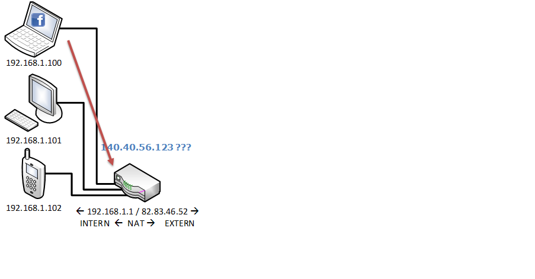
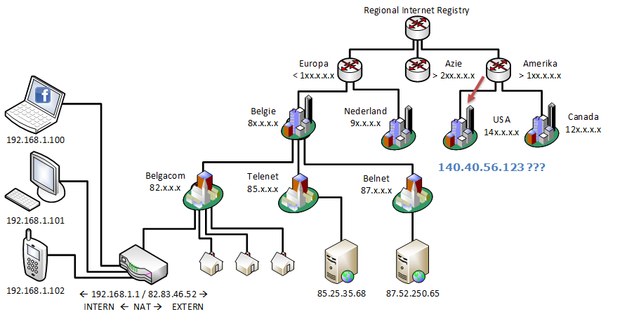
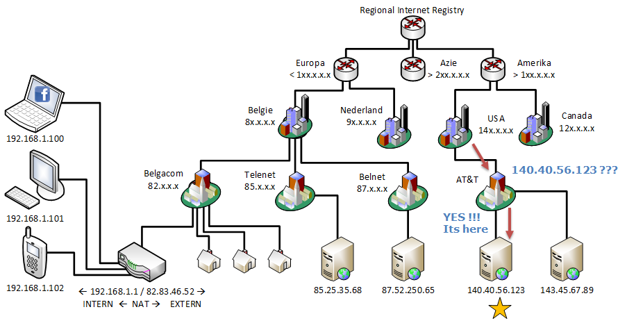
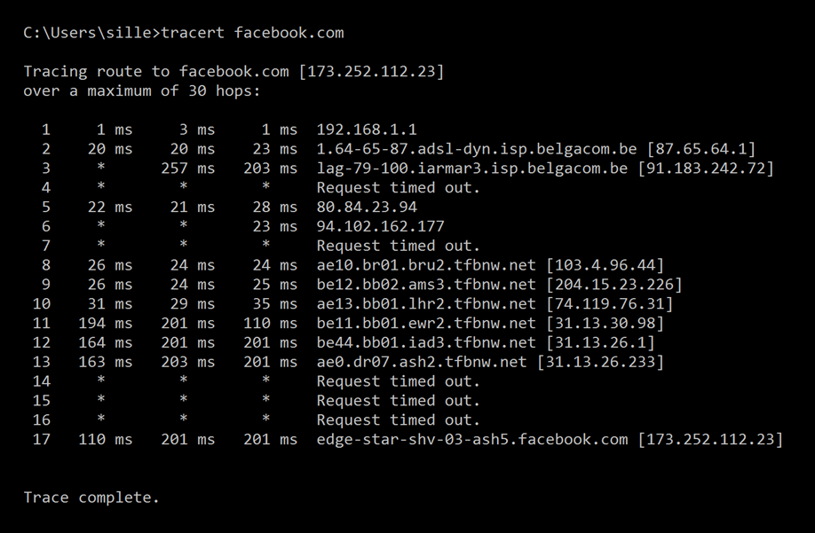
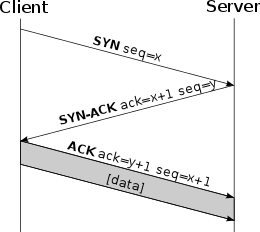

# TCP/IP stack

When using the web, a couple of protocols are used to get everything working smoothly. Let's take a look at some of them.

## IP - Internet Protocol

The IP protocol is the principle protocol for the internet. It **relays** datagrams across network boundaries. Routing functionality enables internetworking, this is what establishes the internet.

The IP protocol enables delivery of packets form source to destination. It also defines packet structure that encapsulates the data.

The Internet Protocol Version 4 - IPv4 - is the dominant protocol of the internet. The 32bit addressing is reaching its limits, so a successor IPv6 - Internet Protocol Version 6 - is already standardized and in use. The migration from IPv4 to IPv6 will take many years to complete.

### IPv4

IPv4 uses 32-bit (four-byte) addresses and is limited to 4294967296 (2^32) addresses. It uses a **quad-dotted** representation

### IPv6

IPv6 is dealing with the long anticipated problem of the limited range of IPv4 addresses. It uses an 128-bit address. Instead of an decimal notation, it uses an hexadecimal notation.

::: tip 😄Fun fact
2^128 = 3.40 x 10^38 different ip addresses are possible with IPv6. On earth there are around 10^20 till 10^24 grains of sand. In the observable universe, there are around 10^24 stars. This means that every grain of sand or every star in the universe can have 100 trillion ip addresses...
:::

> Extra info: [Why Do We Need IP Adresses?](https://www.youtube.com/watch?v=iGPXkxeOfdk)

### IP Routing

You want to visit facebook.com. The facebook.com server has the IP address `140.40.56.123` (got this address from the DNS server)

Source: `192.168.1.100`
Destination: `140.40.56.123`

Where can I find this server with IP: `140.40.56.123`??? Let’s ask the home router (`192.168.1.1`)

Nope, I don’t know where to find the IP `140.40.56.123`

I will ask Belgacom…

Note!!! NAT: Network Address Translation is used here to switch from a local network to the internet (source is changed to `82.83.46.52` instead of `192.168.1.100`) and visa versa when receiving the answer.

Belgacom do you know where to find `140.40.56.123`?

Nope, I only know where to find IP’s ranging from `82.0.0.0` to `82.255.255.255`

I will ask it to the local regstery (for Belgium)

Belgian registry does not know either so forwards the request to the European registry.

European registry does not know either and forwards the request to the Regional Internet Registry.

The Regional Internet Registry does not know either, but does now somebody that might know it and forwards the packet to the American Registry that is responsible for all IP addresses that are between `100.0.0.0` and `199.255.255.255`

The American Registry does not know either, but does now somebody that might know it and forwards the packet to the USA Registry that is responsible for all IP addresses that are between `140.0.0.0` and `149.255.255.255`.

The USA Registry does not know either, but does now somebody that might know it and forwards the packet to the AT&T.

AT&T knows where the server with IP `14.40.56.123` is and forwards the packet to the server.

With the `tracert` command you can test and take a look at the different routers that are between you and the server you want to connect to.

> Extra info: [IP Adresseses and the Internet](https://www.youtube.com/watch?v=L6bDA5FK6gs)

## TCP - Transmission Control Protocol

> The Transmission Control Protocol (TCP) provides reliable, ordered, and error-checked delivery of data between applications running on hosts communicating over an IP network Source: wikipedia

### TCP Handshake

To enable a reliable connection, a *7 way handshake* is used when creating a connection using TCP.

* Connect handshake: A 3 way handwhake to establisch a reliable connection.
* Disconnect handshake: A 4 way handshake to close the connection reliably.

#### Creating a network connection

1. The client sends a TCP-header with `SYN = 1`, a sequence number (to know the order of packets), source port and a destination port to the server.
2. If there is a server listening on the destination address and the given port, it will respond with `SYN = 1`, `ACK = 1` and an aknowledge number x + 1 to confirm the first TCP packet.
3. The client responds with a SYN = 0, ACK = 1 and an aknowledge number x + 1 together with the data needed to be send to the server.
After correctly following the 3 steps, the connection gets `ESTABLISHED`.

#### Closing a network connection

At any moment, the client or server can request to close the connection. This is again done using a handshake in order to get a reliable status about the connection.

1. The initiator sends a packet containing a `FIN` flag to the receiver.
2. The receiver sends an `ACK` flag back to the initiator.
3. The receiver then sends a `FIN` flag to the initiator to indicate that it is ready to close the connection.
4. The connection is then finnaly closed when the initiator sends back an `ACK` flag.

#### TCP ports

TCP also introduces the concept of ports. Port enable the protocol to distinguish between multiple types of packets that are received. This enables to isolate data between multiple applications on the server. A server can as wel host a HTTP server and a Mail server, just by listening to a different port on the same machine.

A port number is just a 16 bit number. This means that up to 65535 different applications can be hosted on a single machine, all isolated from each other.

The first 1024 port numbers are regulated to have a fixed type of service being hosted on them. Ports 1024 - 65535 can be used for anything you want.

Some of the most known ports are:

* `20`: FTP data transfer
* `21`: FTP control (command)
* `22`: Secure Shell (SSH)—used for secure logins, file transfers (scp, sftp) and port forwarding
* `23`: Telnet
* `25`: SMTP, used for email
* `80`: HTTP
* `443`: Hypertext Transfer Protocol over TLS/SSL (HTTPS)
* …

More ports: [Wikipedia](https://en.wikipedia.org/wiki/List_of_TCP_and_UDP_port_numbers)

## TCP/IP

The TCP protocol is almost always used with the IP protocol. Is commonly referred to the TCP/IP stack. A combination of an IP address with an TCP port looks like this `192.168.1.1:80`.

Applications that do not need reliable delivery of data can use UDP instead (User Datagram Protocol)