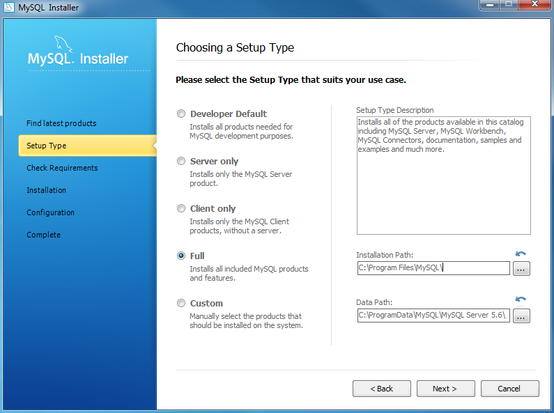
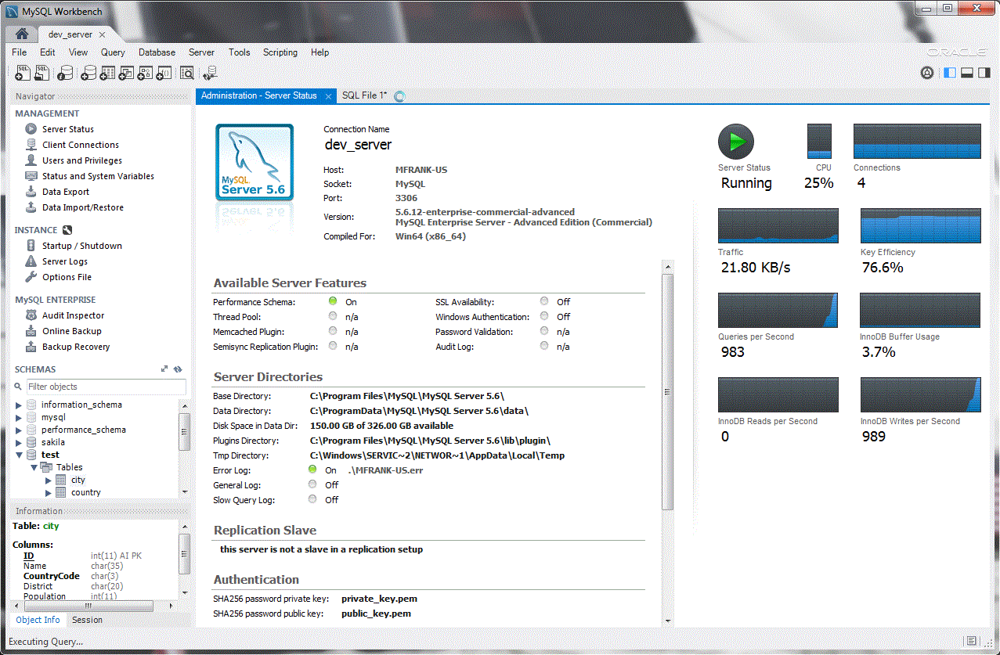

# Backend databases

To be able to store, retrieve, edit or delete data we will use a database.
To be able to do that we need a database service, in this course we will focus on **MySQL** and **MongoDB**.

## Setup MySQL database

First we will need to install our MySQL server from Oracle. [MySQL Community Downloads](https://dev.mysql.com/downloads/installer/)

* Choose the **Full** type and let it install.



* In the configuration set the config type to **Development Machine** port to **3306**.


* Next choose a Root password 

:::warning 🔥Warning
Write your root pasword down somewhere so you don't forget!
:::

Once your MySQL server is up and running you can login to it with your **MySQL Workbench** by using your root acces.



## Setup MongoDB database

First we will need to install our [MongoDB Community Edition](https://www.mongodb.com/try/download/community).

<!-- TODO : Aan te leren en uit te werken -->

## Creating a database with an application user

Because we don't want web applications using the root acces to logon to our database, we will create a new database with a dedicated user to acces only that database.

Now let's use our database admin tool with root acces and create a new database called `VIVES` for school purposes with a specific user called `webuser`to acces this database.

```sql
CREATE DATABASE vives;
USE vives;
CREATE USER 'webuser'@'localhost' IDENTIFIED BY "secretpassword";
GRANT ALL PRIVILEGES ON vives.* TO 'webuser'@'localhost';
```

## CRUD interactions with a database

<!-- TODO : uit te werken -->

