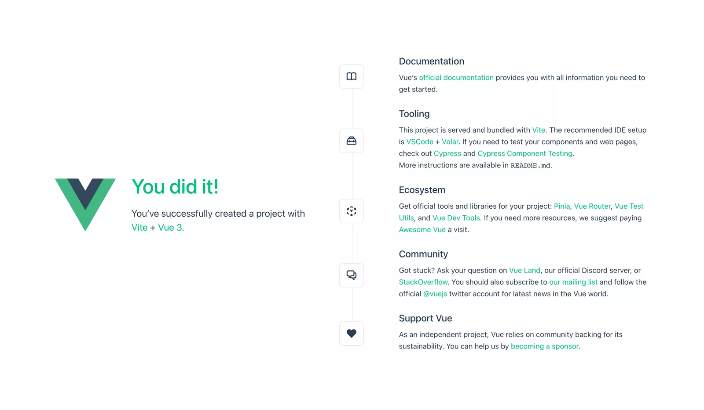
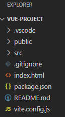
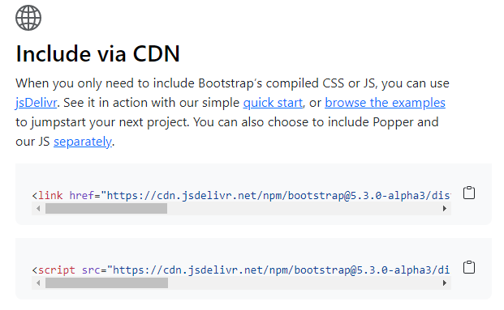

# Frontend development with Vue

## Introduction

A Vue application is made up of independent and reusable components. For example, if we want to build a storefront module like what we see on Amazon, we can devide it into three components. The search bar component, sidebar componenent and products components.

Components can also contain other components. For example, in product component where we display a list of products, we do so using multple product components. Also, in each product component, we can have a rating component.


The benefit of such an architecture helps us to break up a large application into smaller managable components. Plus, we can reuse components within the application or even in a different application.

A Vue component self-contains **template** (HTML-markup), **logic** (Javascript) and **styling** (CSS) in a `.vue` file. It is also called a *Single-File-Component* since it encapsulates all three in a single file.

Below is an example of a product component that display's a single string containing the product name;

``` vue
// Template section
<template>
    <h1>The product name is {{name}}</h1>
</template>
    
//Logic section
<script>
    export default{
        data(){
            return{
                name = 'bag';
            }
        }
    }
</script>

//Styling section
<style scoped>
    h1 {
        color: blue;
    }
</style>
``` 

We have the *template section* containing markup to output HTML. In the curly braces, you can put any Javascript code, e.g. variables, expressions, conditionals, loops. In the template, Vue uses declarative rendering where we can declaratively describe HTML output based on Javascript state.

In the *logic section*, using Javascript, you can set values for variables, define props, create custom/life-cycle methods etc. 

By using CSS we apply the style we want for our output in the *styling section*.

## Setup your Vue application

First, if not already installed, we need to install `Node.js`. See [Chapter Development Tools](../01_developmenttools/#node-js).

The easiest way to start a Vue project is to run the following command in the terminal:

```bash
npm init vue@latest
```

*create-vue*, the official Vue project scaffolding tool will be installed and executed.

You will be asked some questions:
* Project name: ... `<your-project-name>` 👉 **use lower case and no spaces !**
* Add TypeScript? No/Yes
* Add JSX Support? ... No/Yes
* Add Vue Router for Single Page Application development? ... No/Yes
* Add Pinia for state management? ... No/Yes
* Add Vitest for Unit testing? ... No/Yes
* Add Cypress for both Unit and End-to-End testing? ... No/Yes
* Add ESLint for code quality? ... No/Yes
* Add Prettier for code formating? ... No/Yes

If you are unsure about an option, just choose 'No' by hitting *enter* for now.

This will create a project in a newly created `<your-project-name>` folder.

In the terminal enter:

```bash
cd <your-project-name>
npm install
npm run dev
```

This creates a new project in the `<your-project-name>` folder, installs its dependencies (see later) and starts a *dev server* on `http://localhost:5173`.



When you open the project folder in VSCode editor, you will find a couple of files:



Our app lives in the *src* folder. Any other files outside this folder are meant to support building your app.

In the *src* folder we find:

**main.js**

*main.js* is the entry point for our app where we initialize and bring in the main App component:

``` vue
import { createApp } from 'vue'
import App from "./App.vue'

import './assets/main.css'

createApp(App).mount('#app')
```

A Vue application starts by creating a new application instance with the *createApp* function. We import and use the root component App from ./App.vue (see later). 

We call *mount()* to render *App* in *#app* selector of index.html (see later).

**App.vue**

In *App.vue* the App component is defined, it is the root component that contains other components i.e. HelloWorld and TheWelcome as its childeren.

Outside the *src* folder we find:

**package.json**

*package.json* is the node package configuration which lists the packages our project uses (dependencies) and how to build our App (scripts). 

**index.html**

Our Single Page Application loaded in the browser. Our *App.vue* component will be injected into this page.

## Creating and using components

Most likely you don't want to stick with the "hello world" Vue application we nog have. Let's remove the default existing components *HelloWorld.vue*, *TheWelcome.vue*, *WelcomeItem.vue* as well as the *icons* folder.

### Creating our First Component

In the *components* folder create a new file *Products.vue*.

:::tip 💡Tip
We use the UpperCamelCase naming comvention.
:::

We start with the basic sections in our component:

``` vue
//Logic section
<script>
    
</script>

// Template section
<template>
    <h1>Products</h1>
</template>
``` 

So, basicly our component outputs the text "Products".

### Importing and Using our Created Component

As we already know, a component can be used by other components. Let's import and add `<Products />` to `/src/App.vue` by replacing the existing code with:

``` vue
<script>
    import Products from './components/Products.vue';

    export default{
        components:{
            Products
        }
    }
</script>

<template>
    <Products />
</template>
```

We import our *Products.vue* component by there **relative path**, register it under the *components* option to make it available to App and then render the *Products component* in template.

### Options API

With Options API, we define a component's logic using options e.g. *data*, *methods* and *mounted*.

For now we will be looking at *data()*.

Suppose we have a product with a *username* and *category*, we can use *data()* to define this.
*data()* returns an object containing all data we want Vue to work with.

``` vue
<script>
    export default{
        data(){
            return{
                username: 'John',
                category: 'Books'
            }
        }
    }
</script>
```

In our template we can use this data with our curly brackets.

``` vue
<template>
    <h1>Products: {{category}} by {{username}}</h1>
</template>
```

### Displaying a List with Loops

In most cases we will have a list of data to be displayed, let's change our data option as follows:

``` vue
<script>
    export default{
        data(){
            return{
                products:[
                    {
                        id: "1",
                        name: "Books"
                    },
                    {
                        id: "2",
                        name: "Pencils"
                    },
                    {
                        id: "3",
                        name: "Paper"
                    }
                ]                
            }
        }
    }
</script>
```

Now we want to loop true this data and display it:

``` vue
<template>
    <h1>List of products</h1>
    <div v-for='product in products' :key='product.id'>
        <h3>{{product.id}}: {{product.name}}</h3>
    </div>
</template>
```

:::tip 💡Note
* Note that we have provided a *key* attribute (*product.id*) for our product items. The key (product.id) tells Vue how to figure out wich DOM node to change when *products* update. Thus, when dynamically editing the list, and removing/adding elements, you should always pass an identifier in list to prevent issues.
* On large screen like a laptop this is visualized in the center of the screen, to have this on the top left of the screen just remove the media query in the file `main.css`.
:::

## Modifying components

### Bootstrap

Instead of creating our own style in a style.css file, we will be using Bootstrap to style our page.

To get started with Bootstrap, we need to reference bootstrap.css in our `public/index.html`. Go to [getbootstrap.com](https://getbootstrap.com/) and scroll down to the 'Include via CDN' section.



Copy the bootstrap.min.css stylesheet link and the bootstrap.bundle.min.js Javascript link, then paste them into your `<head>` of *index.html*

```html
...
<head>
    ...
    <link href="https://cdn.jsdelivr.net/npm/bootstrap@5.3.0-alpha3/dist/css/bootstrap.min.css" rel="stylesheet" integrity="sha384-KK94CHFLLe+nY2dmCWGMq91rCGa5gtU4mk92HdvYe+M/SXH301p5ILy+dN9+nJOZ" crossorigin="anonymous">
   <script defer src="https://cdn.jsdelivr.net/npm/bootstrap@5.3.0-alpha3/dist/js/bootstrap.bundle.min.js" integrity="sha384-ENjdO4Dr2bkBIFxQpeoTz1HIcje39Wm4jDKdf19U8gI4ddQ3GYNS7NTKfAdVQSZe" crossorigin="anonymous"></script>
   ...
</head> 
```

:::tip 💡Note
Note that we added the attribute `defer` to the Javascript link to make sure it's loads after the DOM is generated.

*The link may change depending on which version of Bootstrap is running.*
:::

To test this, we add a button to our App.vue:

``` vue
<template>
    <button type="button" class="btn btn-primary">Primary</button>
</template>
```

### V-bind

What if we want to disable the button based on some condition.

``` vue
<script>
    export default(){
        data(){
            return{
                isValid: true
            }
        }
    }
</script>

<template>
    <button type="button" class="btn btn-primary" v-bind:disabled="!isValid">Primary</button>
</template>
```

So, when *isValid = false* the *disabled* CSS class will be applied, making the button unclickable.

The *v-bind* directive keeps *disabled* in sync with the component's *isValid* property. We will be using v-bind so many times that is has a dedicated shorthand syntax ':'.

``` vue
<button type="button" class="btn btn-primary" :disabled="!isValid">Primary</button>
```

:::tip 💡Note
Directives with prefix `v-*` indicate they are special attributes provided by Vue. They apply special reactive behavior to the rendered DOM.
:::

### Props

We can pass data into a component by using 'props'. For example, suppose we want to display a list of products with their rating. We will need to pass the rating value to our rating components. We can do something like: `<Rating rating="4"/>` to display a rating of 4 stars.

To do so, in *src/components*, create a new file Rating.vue with the below code.

``` vue
<script>
    export default{
        props: ['rating']
    }
</script>
<template>
    <h1>Rating: {{rating}}</h1>
</template>
```

Our Rating component must declare a 'rating' prop using the *props* option. When a parent component renders `<Rating rating="4"/>`, the *rating* attribute will contain the value of 4. We then render the rating value in *template*.

In `src/App.vue`, replace the code with:

``` vue
<script>
    import Rating from './components/Rating.vue';

    export default{
        components:{
            Rating
        }
    }
</script>

<template>
    <div>
        <Rating rating='1' />
        <Rating rating='2' />
        <Rating rating='3' />
        <Rating rating='4' />
        <Rating rating='5' />
    </div>
</template>
```

In App.vue, we call the Rating component five times with a different *rating* as the props.

### Improving the Look

We will improve the look of our rating component by showing rating stars like what we see on online shops. For this we use Bootstrap Icons.
To use Bootstrap icons, we have to install this in the terminal:

``` bash
npm i bootstrap-icons
```

And include the icon fonts stylesheet in our `<head>` of index.html.

See [icons.getbootstrap.com](https://icons.getbootstrap.com/), in the CDN section for the link.

``` html
<head>
   ...
   <link rel="stylesheet" href="https://cdn.jsdelivr.net/npm/bootstrap-icons@1.10.4/font/bootstrap-icons.css"> 
   ...
</head> 
```

Now we modify our Rating component as follows:

``` vue
<script>
    export default{
        props: ['rating']
    }
</script>
<template>
    <h1>Rating: {{rating}}</h1>
    <i v-if="rating >=1" class="bi bi-star-fill"></i>
    <i v-else class="bi bi-star"></i>
    <i v-if="rating >=2" class="bi bi-star-fill"></i>
    <i v-else class="bi bi-star"></i>
    <i v-if="rating >=3" class="bi bi-star-fill"></i>
    <i v-else class="bi bi-star"></i>
    <i v-if="rating >=4" class="bi bi-star-fill"></i>
    <i v-else class="bi bi-star"></i>
    <i v-if="rating >=5" class="bi bi-star-fill"></i>
    <i v-else class="bi bi-star"></i>
</template>
```

We use the *v-if* directive to conditionally render a filled star if *rating* is >= a value. Else, render a normal (empty) star with the *v-else* couterpart.

### Data in a Vue Component

Every component in addition to having its own template, styles and logic, manages its own reactive data using the *data* option. For example, Rating component can have a reactive data variable *rating* to store the rating value.

``` vue
<script>
    export default{
        props: ['rating'],
        data(){
            return{
                rating: 0
            }
        }
    }
</script>
```

Whenever the reactive data changes, the UI is re-rendered to reflect those changes. Now, we have an issue in that we have a *rating* prop and also *rating* variable in the state. Let's rename the *rating* prop to *initialRating* to better reflect its purpose. Just change *rating* into *initialRating* in App.vue.

Note that props cannot be mutated. In Rating, our prop *initialRating* is used to pass in an initial rating value from the parent. We then assign the value of *initialRating* to the rating state variable in *data()*:

``` vue
<script>
    export default{
        props: ['initalRating'],
        data(){
            return{
                rating: this.initialRating
            }
        }
    }
</script>
```

We also need to change this where we use the rating component:

``` vue
<Rating :initialRating='1' /> 
```

### Handling Events

Next, we want to assign a rating depending on which star the user has clicked. To do so, our component needs to handle the click event. In Vue, you can define a listener for a DOM event in the template using the *v-on* directive (typically shortened to the @ symbol).

First we need a methode that will handle the action for the event:

``` vue{8,9,10,11,12,13}
<script>
    export default{
        props: ['initalRating'],
        data(){
            return{
                rating: this.initialRating
            }
        },
        methods:{
            assignRating(rating){
                this.rating = rating
            }
        }
    }
</script>
```

Next we change our template code to handle the event:

``` vue{3,6,7,10,11,14,15,18,19,22}
<template>
    <h1>Rating: {{rating}}</h1>
    <span v-on:click="assignRating(1)">
        <i v-if="rating >=1" class="bi bi-star-fill"></i>
        <i v-else class="bi bi-star"></i>
    </span>
    <span v-on:click="assignRating(2)">
        <i v-if="rating >=2" class="bi bi-star-fill"></i>
        <i v-else class="bi bi-star"></i>
    </span>
    <span v-on:click="assignRating(3)">
        <i v-if="rating >=3" class="bi bi-star-fill"></i>
        <i v-else class="bi bi-star"></i>
    </span>
    <span v-on:click="assignRating(4)">
        <i v-if="rating >=4" class="bi bi-star-fill"></i>
        <i v-else class="bi bi-star"></i>
    </span>
    <span v-on:click="assignRating(5)">
        <i v-if="rating >=5" class="bi bi-star-fill"></i>
        <i v-else class="bi bi-star"></i>
    </span>
</template>
```

### Adding our own styles

We can further modify our components with our own CSS styles. These *styles* are scoped only to your component. They won't effect to the outer DOM or other components.

To illustrate, suppose we want our filled stars to be orange, we can create a variable for the color:

``` vue{7}
<script>
    export default{
        props: ['initalRating'],
        data(){
            return{
                rating: this.initialRating,
                color: 'orange'
            }
        }
    }
</script>
```

And then add a *style* binding:

``` vue{3}
<template>
    <h1>Rating: {{rating}}</h1>
    <span :style="{color: color}" v-on:click="assignRating(1)">
        <i v-if="rating >=1" class="bi bi-star-fill"></i>
        <i v-else class="bi bi-star"></i>
    </span>
...
```

## Building Forms

To explain how to implement forms with validation logic in Vue, we will implement a login form that takes in fields *email* and *password*.

### Create an Initial Form Template

Create a new file *UserForm.vue* in our `src/components` folder and add the following code:

``` vue
<script>
    export default{

    }
</script>
<template>
    <form>
        <div class="mb-3">
            <label for="exampleInputEmail1" class="form-label">Email address</label>
            <input type="email" class="form-control">            
        </div>
        <div class="mb-3">
            <label for="exampleInputPassword1" class="form-label">Password</label>
            <input type="password" class="form-control">
        </div>        
        <button type="submit" class="btn btn-primary">Submit</button>
    </form>
</template>
```

We can try running the form by rendering *UserForm* in App.vue:

``` vue
<script>
    import UserForm from './components/UserForm.vue';

    export default{
        components:{
            UserForm
        }
    }
</script>

<template>
    <UserForm />
</template>
```

### Form Input Bindings

In Vue forms, we use the *v-model* directive to sync (two-way bind) the form input elements with the component's *data* property.

Modify your code as follows:

``` vue{3,4,5,6,15,19}
<script>
    export default{
        data(){
            return{
                email: '',
                password: ''
            }
        }
    }
</script>
<template>
    <form>
        <div class="mb-3">
            <label for="exampleInputEmail1" class="form-label">Email address</label>
            <input v-model="email" type="email" class="form-control">            
        </div>
        <div class="mb-3">
            <label for="exampleInputPassword1" class="form-label">Password</label>
            <input v-model="password" type="password" class="form-control">
        </div>        
        <button type="submit" class="btn btn-primary">Submit</button>
    </form>
</template>
```

### Showing Specific Validation Errors

Currently, we have the default email validation. But we should be albe to have specific validation errors depending on the input given, for example "Email is required", or "Email should be a minimum of six characters" and show corresponding validation error alerts when a user submits the form.

To show specific validation errors, we declare two data variables to store our email and password error messages, and two booleans to state if email and password fields are valid. In UserForm.vue, add the following code:

```vue{7,8,9,10}
<script>
    export default{
        data(){
            return{
                email: '',
                password: '',
                validEmail: false,
                validPassword: false,
                emailMessage: '',
                passwordMessage: ''
            }
        },    
</script>
...
```

To handle form submission, we define a *onSubmit* handling method. We then bind *onSubmit* to the *submit* event handler in the *form* element.

```vue{6,7,8,9,10,11,16}
<script>
    export default{
        data(){
            ...
        },
        methods:{
            onSubmit(){
                if(this.validEmail && this.validPassword){
                    alert('Email: ' + this.email + '\nPassword: ' + this.password);
                }
            }
        }
    }
</script>
<template>
    <form @submit.prevent="onSubmit">
...    
```

:::tip 💡Note
Note that we specify *@submit.prevent* in the `<form>` tag to prevent the submit event from reloading the page when we send the contents of the form.
:::

In a normal app, we will want to send the form to some external API e.g. login. Before we send the network request in onSubmit, we want to perform some client-side validation.

```vue
<script>
...
        methods:{
            onSubmit(e){
                // Validation Email
                this.validEmail = false;
                if(this.email.length < 6 ) {
                    this.emailMessage = "Email should be minimum 6 characters";
                }
                else if(this.email.indexOf(' ') >= 0){
                    this.emailMessage = "Email cannot contain spaces";
                }
                else {
                    this.emailMessage = '';
                    this.validEmail = true;
                }
                // Validation password
                this.validPassword = false;
                if(this.password.length < 6 ) {
                    this.passwordMessage = "Password should be minimum 6 characters";
                }
                else if(this.password.indexOf(' ') >= 0){
                    this.passwordMessage = "Password cannot contain spaces";
                }
                else {
                    this.passwordMessage = '';
                    this.validPassword = true;
                }
                // Displaying result
                if(this.validEmail && this.validPassword){
                    alert('Email: ' + this.email + '\nPassword: ' + this.password);
                }
            }
        }
    }
</script>
...    
```

### Showing Validation Error Messages

Now, if we enter a invalid email address or password, our form doesn't submit because of the validation checks we have added in. But we should be showing validation errors to the user for her to correct her input.

We will use the *Alert* component from Bootstrap to provide feedback messages.

```vue{8,9,10,15,16,17}
...
<template>
    <form @submit.prevent="onSubmit">
        <div class="mb-3">
            <label for="exampleInputEmail1" class="form-label">Email address</label>
            <input v-model="email" type="email" class="form-control">            
        </div>
        <div v-if="emailMessage.length > 0" class="alert alert-danger" role="alert">
            {{ emailMessage }}
        </div>
        <div class="mb-3">
            <label for="exampleInputPassword1" class="form-label">Password</label>
            <input v-model="password" type="password" class="form-control">
        </div>
        <div v-if="passwordMessage.length > 0" class="alert alert-danger" role="alert">
            {{ passwordMessage }}
        </div>        
        <button type="submit" class="btn btn-primary">Submit</button>
    </form>
</template>
```

### Clearing the Fields upon Succesful Submit

Currently, after submitting our form, the user-entered values in the fields remain. They should be cleared after submission. To do so, in onSubmit, after succesful validation, we clear the email and password state and also set validEmail and validPassword to false:

```vue
<script>
...
                if(this.validEmail && this.validPassword){
                    this.email = '';
                    this.password = '';
                    this.validEmail = false;
                    this.validPassword = false;
                }
...
</script>
...
```
