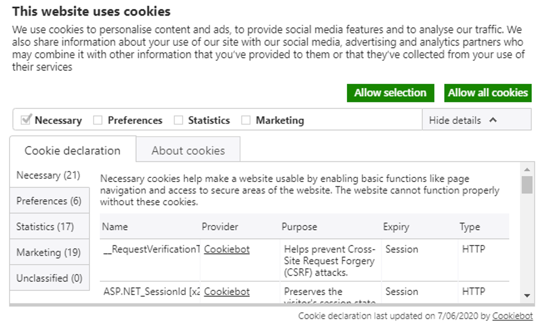

# Privacy

Let's talk about the privacy of the users of your website.

## legislation

Let's first watch [this video](https://www.youtube.com/watch?v=QWw7Wd2gUJk) to better understand the problem with cookies.

### GDPR

Companies have the right to process users' personal data if they have received permission or if they have a legitimate interest (e.g. to prevent fraud).

### ePrivacy Regulation

This is an extension of the GDPR legislation that will come into force soon:

* do not prohibit access to websites if the use of cookies has not been approved
* wifi location and device tracking
* privacy setting of the browsers by default
* regulation of the content of the metadata (cookies)

### Classification

Cookies fall under the following classification:

#### Duration

* session cookies: temporary and disappear when you close the browser
* persistent cookies: all other cookies => maximum 12 months according to ePrivacy Directive

#### Provenance

* first-party cookies: the cookies placed by the website you visit
* third-party cookies: these placed by a third party such as an advertiser (ads) or an analytic system

#### Purpose

* strictly necessary cookies: for example to log in, shopping cart contents
* preference cookies (functionality cookies): choices such as language, username and automatic login
* statistics cookies (performance cookies): counters, how the website was used, ... But made anonymous, can no longer be traced back to a person
* marketing cookies: track your online activity and help advertisers to target their advertising, usually third-party and persistent

### Cookie guidelines

* users must give permission before using cookies, except for the necessary cookies (strictly necessary cookies)
* informing the user exactly what data each cookie tracks, and this before consent is obtained
* document and store user consents
* allow users to use your service, even if they did not consent to certain cookies
* giving users the option to withdraw their consent

This is an nice example:

## Cookie

A cookie is a small block of data (up to 4096 bytes) that the server sends to the client browser with the first HTTP Response. This client browser will send this cookie to the server with every subsequent HTTP request.

Initially, this was designed to keep track of who you are and what's in your shopping cart.

When the cookie is created, it is given a **name**, a **value** and an **expiration date** (number of seconds from 1970).

### Example

To be added...

<!-- TODO : kijken naar onderstaande sites en zelf eens proberen  -->

<!-- TODO :  https://github.com/orestbida/cookieconsent -->

<!-- TODO :  https://markus.oberlehner.net/blog/implementing-a-gdpr-consent-workflow-with-vue/ -->